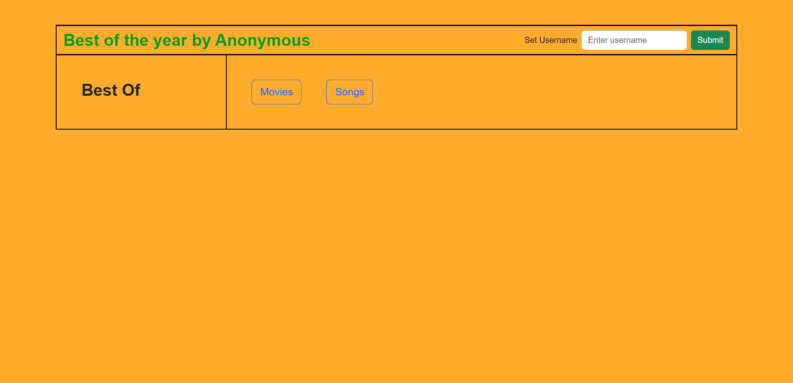
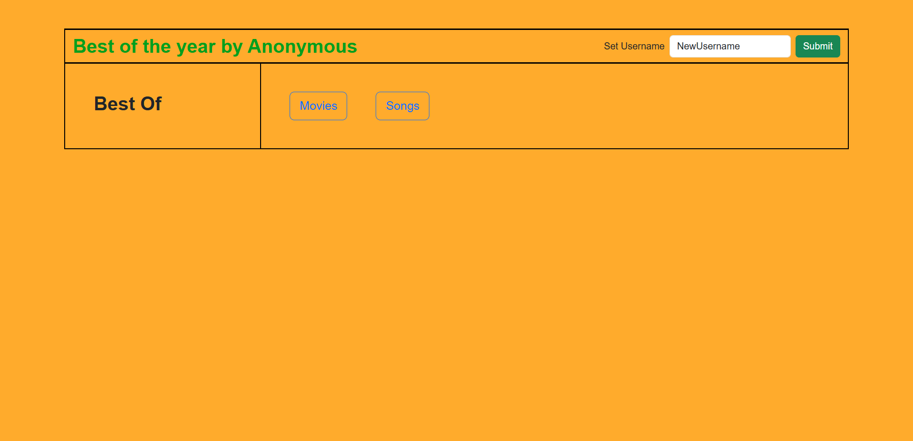
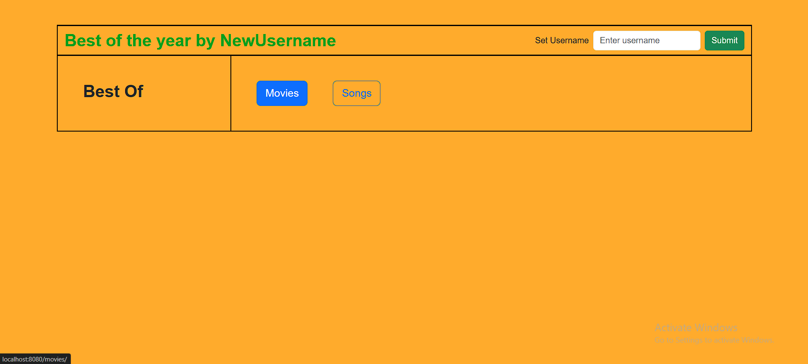
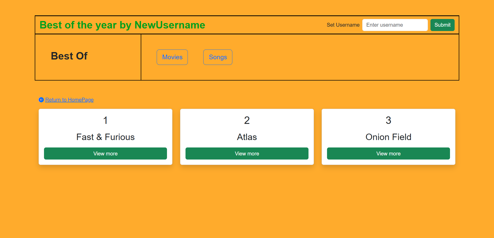
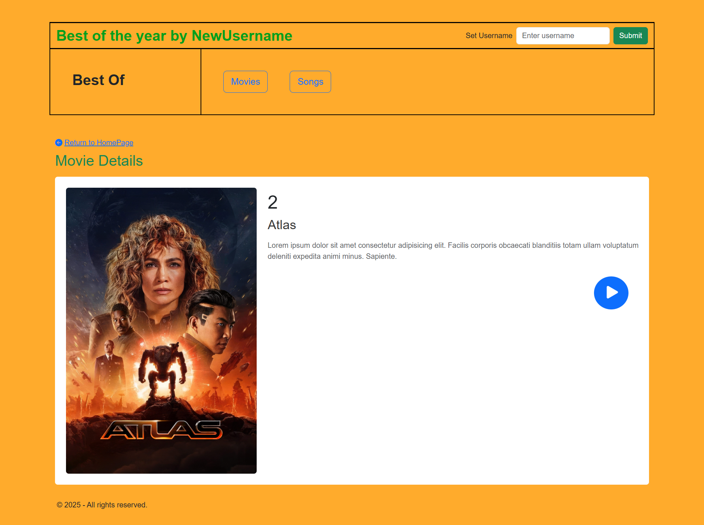
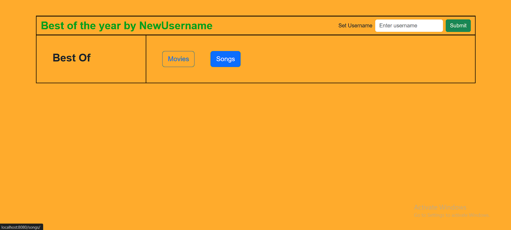
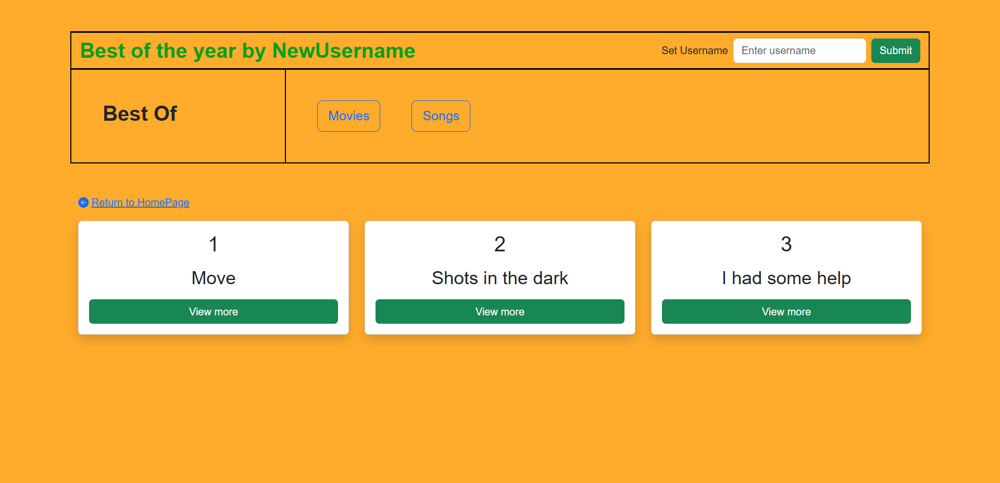
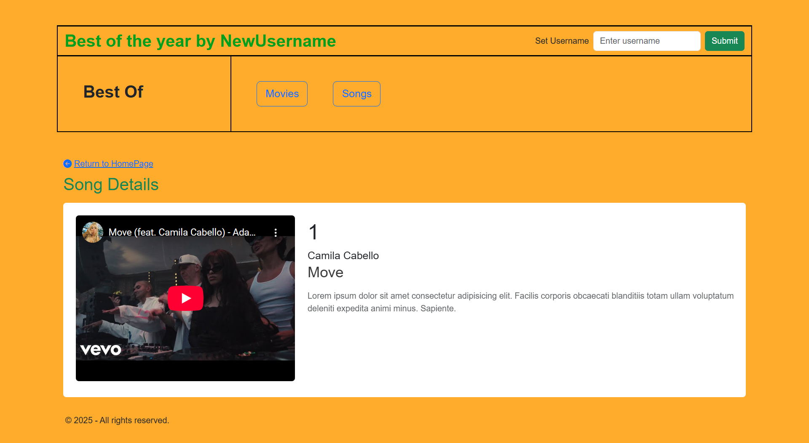

## Web App w Spring Controllers, Thymeleaf Fragments & Spring Beans 
output:

Developed a Java Spring Boot web application leveraging Spring Controllers for routing, Spring Beans for data management, and Thymeleaf Fragments for modular and reusable UI components. The application features dynamic movie and song listings with session-based user handling, ensuring efficient and maintainable code architecture.

